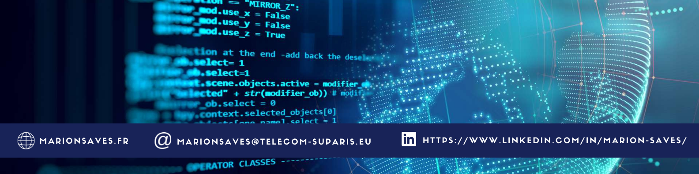

## Hi there 👋

I'm a third year student at [Télécom SudParis](https://www.telecom-sudparis.eu/), an [Institut Polytechnique de Paris](https://www.ip-paris.fr/) school, where I major in Computer Science. 

Here is my [French CV](assets/CV_SavesMarion.pdf) and here [the English one](assets/CV_SavesMarion_En.pdf).

## How to reach me 📫

#### Personal Website
https://www.marionsaves.fr

#### Linkedin
https://www.linkedin.com/in/marion-saves/

## Technologies✨

<!--
**Saves-Marion/Saves-Marion** is a ✨ _special_ ✨ repository because its `README.md` (this file) appears on your GitHub profile.

Here are some ideas to get you started:

- 🔭 I’m currently working on ...
- 🌱 I’m currently learning ...
- 👯 I’m looking to collaborate on ...
- 🤔 I’m looking for help with ...
- 💬 Ask me about ...
- 📫 How to reach me: ...
- 😄 Pronouns: ...
- ⚡ Fun fact: ...
-->
